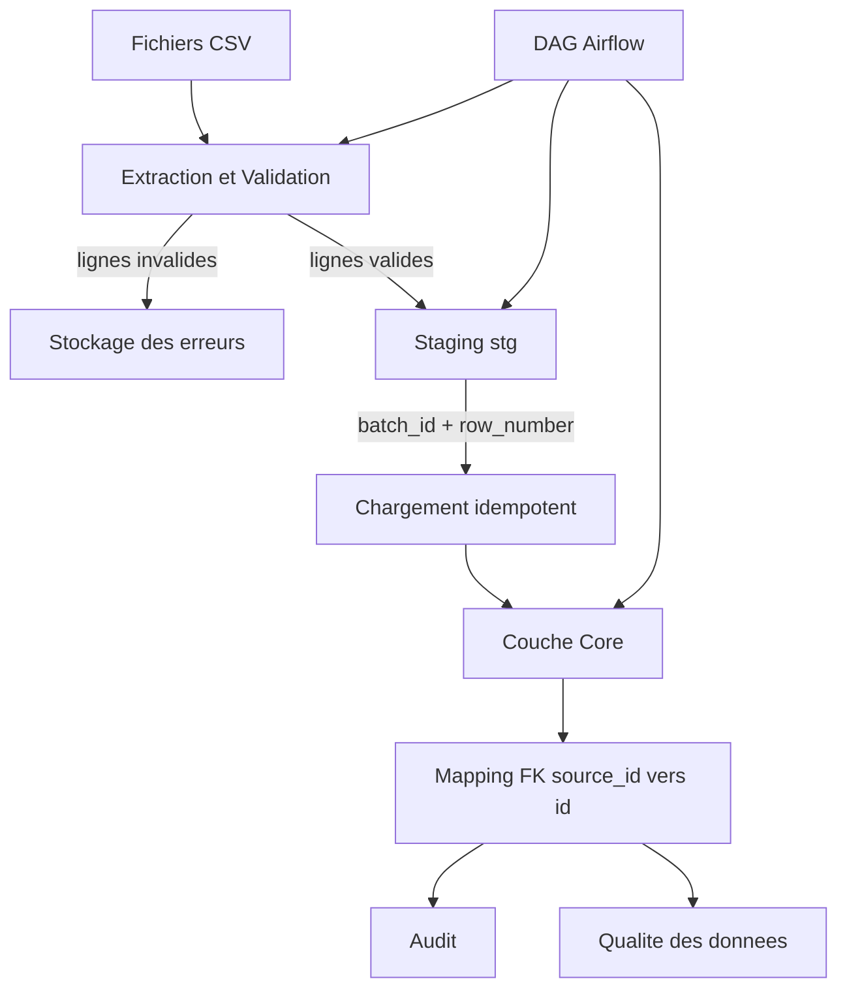

# Pipeline ETL de type production (Python, PostgreSQL, Airflow)


## Vue d’ensemble
Ce projet propose un pipeline ETL complet, conçu selon des standards proches de la production. 
Il ingère des fichiers CSV, applique des contrôles de qualité, transforme les données et les charge dans PostgreSQL, 
au sein d’une architecture modulaire et robuste orchestrée par Airflow.

Fonctionnalités:
- Configuration YAML
- Exécution basée sur dépendances
- Chargement idempotent
- Validation qualité des données
- Audit des batchs
- Orchestration Airflow

---

## Architecture

### Flux
CSV → validation → bad records → staging → core → audit + qualité

### Diagramme d’architecture



---

## Couches

### Staging (stg_*)
- append-only
- données normalisées brutes
- colonnes en TEXT
- métadonnées :
  - batch_id
  - source_file
  - source_row_number
  - raw_record
- idempotent (temp table + ON CONFLICT)

### Core
- schéma normalisé
- colonnes typées
- clés techniques (id)
- clés métier (source_id)
- relations FK
- UPSERT

---

## Configuration YAML

configs/mappings.yaml

Définit:
- fichiers
- tables
- clés primaires (source → normalisée)
- mappings
- dépendances
- transformations

### Exemple de mapping

```yaml
orders:
    path: orders.csv
    table: orders
    primary_key: id
    depends_on:
      - entities
      - agents
    columns:
      source_id:
        source: id
        type: int
        required: true
      ent_id:
        type: int
        required: true
      order_qty:
        type: float
        required: false
      price:
        type: float
        required: false
      order_sum:
        type: float
        required: true
      ag_id:
        type: int
        required: true
      ag_ch_id:
        type: int
        required: true
```

Logique:

orders.ent_id → entities.source_id → entities.id  
orders.ag_id → agents.source_id → agents.id

---

## Graphe de dépendances

- Construit à partir de YAML
- Tri topologique
- Détection des cycles
- Garantit l'ordre de chargement correct

entities → orders
agents → orders

## Chargement idempotent

Implémenté à l'aide de :

- tables temporaires
- INSERT ... ON CONFLICT DO NOTHING
- contrainte d'unicité :
  (batch_id, source_file, source_row_number)

Résultat :
- tentatives de réinsertion sécurisées
- aucune donnée dupliquée

---

## Exemple de chargement Core (SQL)

La couche core est alimentée à partir des tables staging avec mapping des clés étrangères.
Exemple : chargement de `orders` avec des références à `entities` et `agents`

```sql
WITH latest AS (
            SELECT DISTINCT ON (NULLIF(source_id,'')::double precision::int)
                source_id,
                ent_id,
                order_qty,
                price,
                order_sum,
                ag_id,
                ag_ch_id
            FROM stg_orders
            WHERE NULLIF(source_id,'') IS NOT NULL
              AND batch_id = %s
            ORDER BY NULLIF(source_id,'')::double precision::int, loaded_at DESC, stg_id DESC
        )
        INSERT INTO orders (
            source_id,
            ent_id,
            order_qty,
            price,
            order_sum,
            ag_id,
            ag_ch_id
        )
        SELECT 
            NULLIF(l.source_id,'')::double precision::int,
            e.id AS ent_id,
            NULLIF(l.order_qty,'')::double precision,
            NULLIF(l.price,'')::double precision,
            NULLIF(l.order_sum,'')::double precision,
            parent_ag.id AS ag_id,
            child_ag.id AS ag_ch_id
        FROM latest l
        JOIN entities e
            ON NULLIF(l.ent_id,'')::double precision::int = e.source_id
        JOIN agents parent_ag
            ON NULLIF(l.ag_id,'')::double precision::int = parent_ag.source_id
        JOIN agents child_ag
            ON NULLIF(l.ag_ch_id,'')::double precision::int = child_ag.source_id
           AND child_ag.parent_id = parent_ag.id
        ON CONFLICT (source_id) DO UPDATE
        SET
            ent_id = EXCLUDED.ent_id,
            order_qty = EXCLUDED.order_qty,
            price = EXCLUDED.price,
            order_sum = EXCLUDED.order_sum,
            ag_id = EXCLUDED.ag_id,
            ag_ch_id = EXCLUDED.ag_ch_id;
```
Explication:

stg_orders contient les données issues des CSV
entities et agents sont des tables core
mapping via source_id
ON CONFLICT garantit l’idempotence
batch_id isole chaque exécution

---

## Qualité des données

Contrôles effectués :
- Le fichier existe
- Le fichier n’est pas vide
- Validation du schéma
- Validation au niveau de la ligne
- Suivi des mauvais enregistrements
- Détection des doublons
- Références manquantes
- Relations non valides

Gravité :
- avertissement → le pipeline continue
- critique → défaillance du pipeline

---

## Audit

Suivi dans etl_batches:
- batch_id
- started_at
- finished_at
- status
- error_message

Comportement idempotent pris en charge.

---

## Airflow
- Basé sur Docker
- Exécuteur local
- DAG dynamique avec exécution prenant en compte les dépendances
- Une tâche par table

---

## Tests

Inclut :

- Validation du contrat YAML
- Validation du graphe de dépendances
- Vérifications de cohérence du mappage

---

## Exécution
```bash

   docker compose up airflow-init
   docker compose up -d

   python scripts/pipeline.py

   Idempotency de test :
   BATCH_ID=11111111-1111-1111-1111-111111111111 python scripts/pipeline.py
```

---

## Structure du projet

configs/        # Mappings YAML
scripts/        # Logique ETL
tests/          # Tests pytest
logs/           # Journaux du pipeline ETL
dags/           # Définitions des DAGs Airflow
data/           # Dossier contenant les fichiers CSV

---

## Limitations

- CI basique avec pytest
- Pas de pipeline de déploiement
- Traitement par lots uniquement (pas de chargement incrémentiel)
- Supervision limitée
- Airflow en environnement local
- La couche staging stocke toutes les valeurs en TEXT
- La conversion de type est gérée dans la couche core
---

## Tech Stack

- Python (pandas, psycopg2)
- PostgreSQL
- Apache Airflow
- Docker
- YAML

## Objectif du projet

Ce projet vise à concevoir un système ETL de niveau professionnel démontrant :
- les meilleures pratiques d'ingénierie des données
- la fiabilité du pipeline
- une architecture propre
- des modèles concrets
